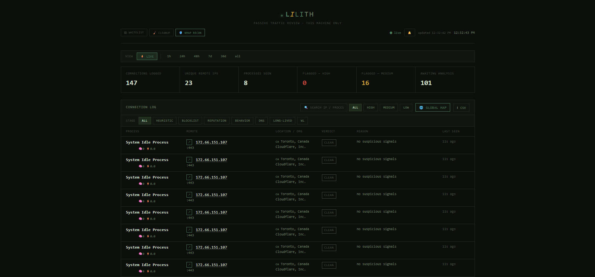
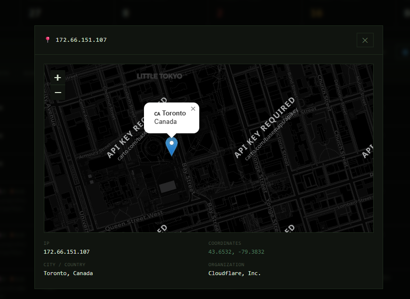
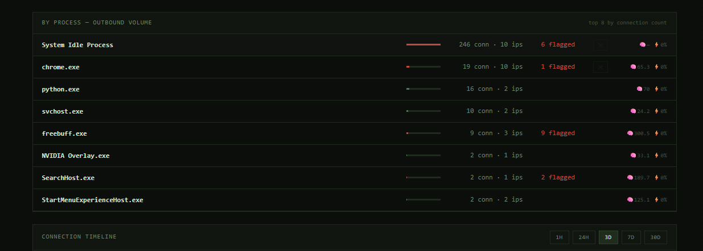
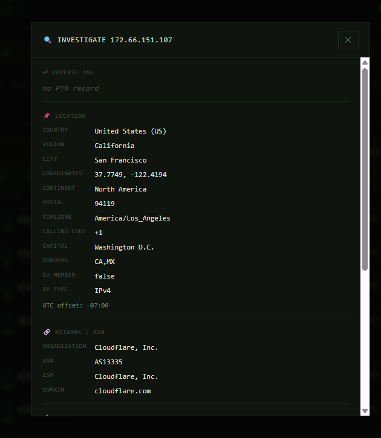

<div align="center">

# Lilith

**Passive, system-wide network security monitor for Windows**

Log every outbound connection · resolve the owning process · geolocate the remote IP · triage everything through a 7-stage rule-based pipeline — all locally, with no AI and no API keys.

[](#)
[](#)
[](#)
[](#)

</div>

---

> ⚠️ **This tool only watches and reports. It never blocks anything.**

Lilith is a passive monitor in the spirit of classic network tools (TCPView, GlassWire, Little Snitch, Snort): it polls the Windows connection table, enriches every flow with process, geolocation, and ASN data, and scores it through layered heuristics, threat-intel feeds, and behavioral anomaly detection. Every flag is a **human-review item** — precision over recall.

## ✨ Highlights

- **Real-time monitoring** — polls the Windows connection table every 3 seconds; optional **ETW kernel-network tracing** catches short-lived connections that polling misses
- **Process resolution** — which executable, PID, command line, and resource usage owns each connection
- **IP geolocation + ASN enrichment** — country, city, and hosting org via ip-api.com, plus Team Cymru IP→ASN and reverse-DNS (all free, key-less)
- **7-stage triage pipeline** — whitelist → heuristics → blocklist → reputation → behavior → DNS/DGA → long-lived
- **69 heuristic rules** — script-interpreter/LOLBin abuse, system-process masquerading, Office macro C2, port mismatches, injected processes, hosting-ASN abuse (mapped to MITRE techniques)
- **Threat-intel blocklists** — Feodo Tracker botnet C2 IPs + Spamhaus ZEN (both free, no key)
- **IP reputation** — SANS DShield community threat data
- **Behavioral analysis** — rolling-window burst, country-spread, and IP-spread detection per process
- **DNS / DGA detection** — Shannon-entropy scoring on hostnames, DoH/DoT detection
- **Long-lived connection detection** — flags tunnels and reverse shells (ESTABLISHED > 4h on odd ports)
- **Interactive dashboard** — WebSocket live view, timeline chart, global map, process view, recon panel, CSV export
- **Time-range history** — browse 1h / 24h / 48h / 7d / 30d / all-time with scope-consistent stats
- **Fully offline-capable** — every network-dependent feature degrades gracefully; the core pipeline runs without internet

## 📸 Screenshots

### Dashboard

Live connection log with severity badges, pipeline stage markers, and real-time stats.



### Global map

Every geo-located remote IP plotted on an interactive world map (Leaflet, dark tiles).



### Processes & timeline

Top processes ranked by outbound volume with resource indicators, plus the connection timeline chart.



### Recon panel

Per-IP investigation: reverse DNS, fast TCP port scan, WHOIS/RDAP registrar data, and optional nmap integration with nine scan profiles.



## 🚀 Quick Start

### 1. Install Python 3.10+

```powershell
winget install Python.Python.3.12
```

### 2. Install `uv` (recommended — optional)

```powershell
winget install astral-sh.uv
```

> No `uv`? The launchers fall back to plain Python + pip automatically.

### 3. Install dependencies

```powershell
git clone https://github.com/YOUR_USERNAME/lilith.git  # ← change to your repo URL
cd lilith
uv sync
```

### 4. Run

> **Run PowerShell as Administrator** for full process visibility and ETW real-time capture.

```powershell
.\run.ps1                  # PowerShell launcher — admin check, opens browser
.\run.ps1 -Fresh           # wipe netmonitor.db on startup
.\run.ps1 -Port 8080       # different port
.\run.ps1 -NoBrowser       # don't auto-open the dashboard

run.bat                    # cmd.exe fallback (same flags: --fresh / --port / --no-browser)
```

Or directly:

```powershell
$env:PYTHONDONTWRITEBYTECODE=1; uv run python -m uvicorn lilith.app:app --port 8000
```

### 5. Open the dashboard

Visit **http://localhost:8000**

> **Optional — ETW real-time capture:** `uv sync --extra etw` installs `pywintrace`
> for kernel-network tracing (catches connections that a poll can miss).
> Without it (or without admin), Lilith gracefully falls back to psutil polling.

## 🏗️ How the Pipeline Works

```
┌──────────────┐     ┌──────────┐     ┌───────────┐     ┌─────────┐
│  capture.py  │ ──> │ SQLite   │ <── │  geoip.py │ <── │ asn.py  │
│  (polls 3s)  │     │  .db     │     │  (20s)    │     │ (20s)   │
│ + etw (opt)  │     └────┬─────┘     └───────────┘     └─────────┘
└──────────────┘          │
                   ┌──────▼──────┐
                   │  pipeline   │
                   │ Stage 1     │  whitelist — skip known-good IPs/processes
                   │ Stage 2     │  heuristics — 69 rules (process + port patterns)
                   │ Stage 3     │  blocklist — Feodo C2 IPs + Spamhaus ZEN
                   │ Stage 4     │  reputation — SANS DShield (free, no key)
                   │ Stage 5     │  behavior — rolling window anomalies
                   │ Stage 6     │  dns — DGA entropy / DoH / DoT
                   │ Stage 7     │  longlived — tunnels / reverse shells
                   └──────┬──────┘
                          │
                   ┌──────▼──────┐
                   │   app.py    │  ← dashboard.html
                   │  FastAPI    │  ← WebSocket / API
                   └─────────────┘
```

The triage loop runs every ~1 second and processes up to 20 connections per cycle. The **first stage that finds something wins**; connections that pass all seven stages are marked **clean** and never re-processed.

| Stage | Module | What it detects |
|-------|--------|-----------------|
| **1. Whitelist** | `pipeline.py` | Known-good IPs/processes you've approved — skipped instantly |
| **2. Heuristics** | `stage2_heuristics.py` | 69 rules: script interpreters on suspicious ports, system-process anomalies (lsass/services outbound, masquerading from non-System32 paths), Office macro C2, port mismatches, injected/masquerading processes, known-safe apps |
| **3. Blocklist** | `blocklist.py` | Feodo Tracker botnet C2 IPs (HIGH) + Spamhaus ZEN SBL/CSS/XBL/PBL (MEDIUM/LOW) |
| **4. Reputation** | `stage3_reputation.py` | IPs with reported attacks on SANS DShield (≥100 → HIGH, ≥1 → MEDIUM) |
| **5. Behavior** | `behavior.py` | Connection bursts (>10 in 60s), country spread (>3 countries), IP spread (>8 IPs) per process |
| **6. DNS** | `dns.py` | DGA Shannon entropy (≥3.5) / consonant-heavy hostnames, DoH SNI, DoT port 853 |
| **7. Long-lived** | `pipeline.py` | ESTABLISHED > 4h on unusual ports — tunnel / reverse shell |

## 🖥️ Dashboard

| Panel | Description |
|---|---|
| **Connection log** | Every connection seen, newest first. Filter by severity, pipeline stage, or search by IP / process / country / org. |
| **Connection timeline** | Line chart with smart auto-bucketing per time range |
| **By process** | Top processes by outbound volume, with memory/CPU indicators and a one-click kill button |
| **Global map** | All geo-located IPs on an interactive dark world map |
| **Whitelist** | Mark trusted IPs and processes from any row (⊞ button) |
| **Recon** | Per-IP investigation — reverse DNS, port scan, WHOIS/RDAP, nmap scans |
| **Cleanup** | Retention settings, purge, fresh start, VACUUM |

Time ranges: `⚡ LIVE` · `1h` · `24h` · `48h` · `7d` · `30d` · `all`

## 📡 API Endpoints

| Method | Path | Description |
|---|---|---|
| GET | `/api/connections` | List connections (filter by `time_range`, `severity`, `search`, `pipeline_stage`) |
| GET | `/api/stats` | Aggregate statistics (scoped to `time_range`) |
| GET | `/api/processes` | Top processes by outbound volume |
| GET | `/api/timeline` | Connection counts with auto-bucketing |
| GET | `/api/geo-detail/{ip}` | Full geo details for a specific IP |
| GET | `/api/geo-all` | All geo-located IPs with coordinates |
| GET | `/api/investigate/{ip}` | Reverse DNS + port scan + WHOIS/RDAP for an IP |
| GET | `/api/nmap-scan/{ip}` | Run an nmap scan (profile: quick, full, aggressive, …) |
| GET | `/api/export/csv` | Download filtered connections as CSV |
| GET/POST/DELETE | `/api/whitelist` | Manage whitelist entries |
| GET/POST | `/api/cleanup…` | Retention config, purge, fresh start, VACUUM |
| DELETE | `/api/kill-process/{pid}` | Terminate a process |
| WS | `/ws` | WebSocket — pushes live data every 2s |

## ⚙️ Configuration

| Variable | Default | Effect |
|----------|---------|--------|
| `LILITH_DB_PATH` | `<project>/netmonitor.db` | Store the SQLite database elsewhere |
| `LILITH_FRESH=1` | — | Delete the database on startup for a fresh session |
| `PYTHONDONTWRITEBYTECODE=1` | — | Prevents `__pycache__` clutter (launchers set it) |

## 🛠️ Running Without Internet

The pipeline degrades gracefully at every network-dependent stage:

| Feature | Without internet |
|---|---|
| Geolocation (ip-api.com) | Skipped — rows stay un-enriched |
| Blocklists (Feodo / Spamhaus ZEN) | Skipped silently |
| Reputation (DShield) | Skipped silently |
| Whitelist, heuristics, behavior, DNS/DGA, long-lived | **Work fully offline** |

## ❗ Troubleshooting

| Problem | Solution |
|---|---|
| No connections appearing | Run PowerShell as **Administrator** |
| Processes showing as "unknown" | Admin rights are needed — see above |
| `uv` not found | Install with `winget install astral-sh.uv` (or use plain Python — the launchers fall back automatically) |
| Port 8000 already in use | `.\run.ps1 -Port 8080` |
| Geolocation not working | ip-api.com has a 45 req/min limit — Lilith backs off automatically |
| Dashboard not updating | Check browser console (F12) for WebSocket errors; the dashboard falls back to HTTP polling |
| Everything shows "clean" | Expected for normal traffic — rules only flag suspicious patterns. See `stage2_heuristics.py` to review the rule set |
| Database grows too big | Dashboard → 🧹 cleanup → adjust retention / purge / vacuum |

## 📁 Project Structure

```
├── lilith/                   # Main Python package — all app modules
│   ├── app.py                # FastAPI server — API + WebSocket + dashboard
│   ├── capture.py            # Connection capture — polls psutil, writes to SQLite
│   ├── etw_capture.py        # Optional real-time ETW kernel-network capture
│   ├── geoip.py              # IP geolocation — ip-api.com batch resolver
│   ├── asn.py                # Team Cymru IP→ASN + reverse-DNS enrichment
│   ├── pipeline.py           # Pipeline orchestrator — runs all 7 stages
│   ├── stage2_heuristics.py  # Stage 2: 69 heuristic rules across 7 categories
│   ├── stage3_reputation.py  # Stage 4: IP reputation via SANS DShield
│   ├── blocklist.py          # Stage 3: Feodo Tracker + Spamhaus ZEN
│   ├── behavior.py           # Stage 5: Rolling-window behavioral anomaly detection
│   ├── dns.py                # Stage 6: DGA entropy / DoH / DoT detection
│   ├── triage.py             # Triage loop — drains the pipeline every 1s
│   ├── history.py            # Time-range-aware query module
│   └── cleanup.py            # Auto-purge daemon for old connections
│
├── dashboard.html            # Frontend UI — real-time WebSocket dashboard
├── docs/screenshots/         # Dashboard screenshots used in this README
├── netmonitor.db             # SQLite database (auto-created at runtime)
├── run.ps1                   # PowerShell launcher (recommended)
├── run.bat                   # cmd.exe fallback launcher
├── pyproject.toml            # Project config & dependencies
├── FEATURES.md               # Full feature checklist
├── INSTRUCTIONS.md           # Detailed setup, transfer & troubleshooting guide
└── ROADMAP.md                # Improvement roadmap & design notes
```

## ❓ Frequently Asked Questions

**Does Lilith use AI/LLMs?**
No. Every verdict comes from deterministic rules, threat-intel lookups, or behavioral statistics. Nothing is sent to any AI service.

**Does it block anything?**
No. Lilith is strictly passive — it watches, enriches, and reports. You decide what to do with a flagged connection (the dashboard does offer a kill button for processes you judge malicious).

**What data leaves my machine?**
Only enrichment queries: IP geolocation (ip-api.com), ASN/reverse-DNS (Team Cymru DNS), threat-intel lookups (DShield, Spamhaus, abuse.ch), and WHOIS/RDAP in the recon panel. No connection payloads, no telemetry, no analytics.

**Why do I need Administrator rights?**
Windows restricts per-process visibility for non-elevated processes. Without admin, some connections show `proc_name = "unknown"` and ETW real-time capture stays disabled.

## 🗺️ Roadmap

See [ROADMAP.md](ROADMAP.md) for the full plan. Up next, in order:

1. **Beacon regularity scoring** (RITA-style) — catch low-and-slow periodic C2 that burst rules miss
2. **Connection churn detection** — rapid connect/disconnect cycles per process
3. **New-destination tracking** — persist first-contact IPs per process
4. **ETW DNS-Client capture** — query-level DGA detection

## 🤝 Contributing

Issues and pull requests are welcome. Good first contributions: additional heuristic rules (with MITRE mapping), more key-less threat-intel feeds, and dashboard improvements.

## 📄 License

This project is licensed under the MIT License — see [LICENSE](LICENSE) for details.
